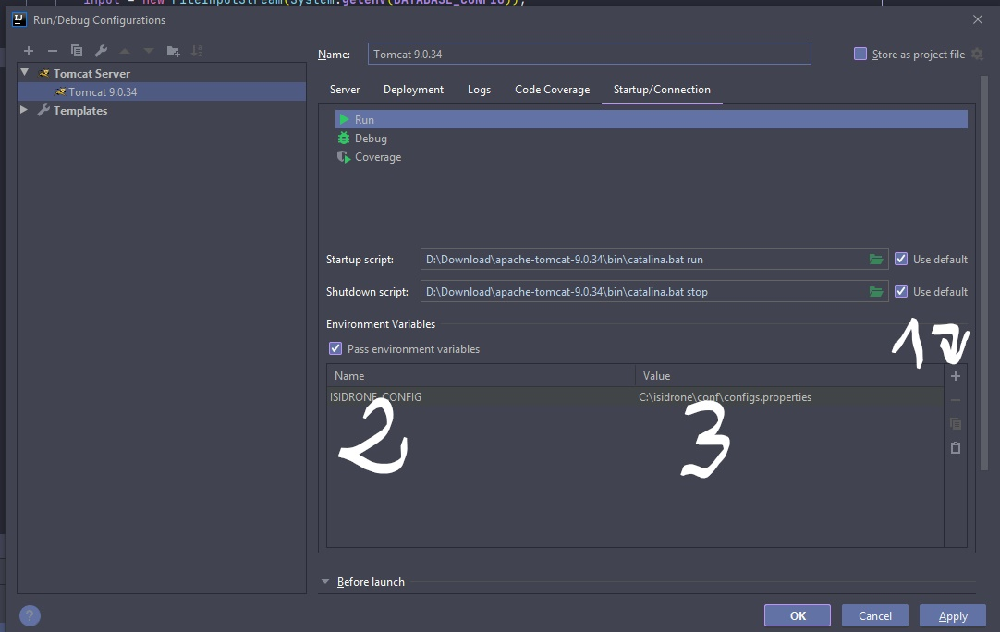

## ISIDrone
This is a e-commerce website selling drones built on JAVA, MySQL and deployed to both Window/Linux systems, our team was assigned to add more features to this projet. We have worked on Jira for project management, Jenkins for auto-deployment and worked as a team with a product owner to simulate real-enterprise working context.

The application allows client to sign up, sign in, modify their cart, pass orders, and modify their account information. The application also has a administration system which allows managing products, categories, products informations and read or modify client informations. The application also has a security check system which prohibites malicious actions against the backend.

## Techstack
JAVA, Intellij, Jira, and Jenkins

## Installation / Deployment
##### For windows system (with Intellij)

To test the project, you should: 
- add the external images folder to Tomcat deployment:
Edit Tomact Configurations -> Tab Deployment -> Add -> External Sources -> Choose the products images folder


- Tab `Startup/Connection`, choose `pass environement variables` and add an environement variable with the name `CATALINA.BASE` and value pointing to your Tomcat root folder


- Apply all changes and rebuild the project

##### For Linux system
To test the project in Linux environment:

- Install tomcat in your linux system
- Create `isidrone/products/img/` at the root base `/`
- Transfer all products images into the above created folder
- cd to `/isidrone/products/` and use command `chown tomcat:tomcat img/` to give access to Tomcat to images
- add context base `<Context docBase="/isidrone/products/img"  path="/ISIDrone/images/products" />` to your Tomcat `server.xml`. This is to allow Tomcat access to the product images folder
- Restart the Tomcat


## Configuration of the database

- Create folder `isidrone/conf/` at the root base `/`
- Transfer configs.properties ( userGuide/configs.properties ) into the above created folder

### configs.properties
```java
DB_NAME=isidrone
DB_IP=127.0.0.1
DB_PORT=3306
DB_USERNAME=root
DB_PASSWORD=abc123...
```

### Tomcat configuration



- Tab `Startup/Connection`, choose `pass environement variables` and add an environement variable with the name `ISIDRONE_CONFIG` and value `C:/isidrone/conf/configs.properties`

- Restart the Tomcat
